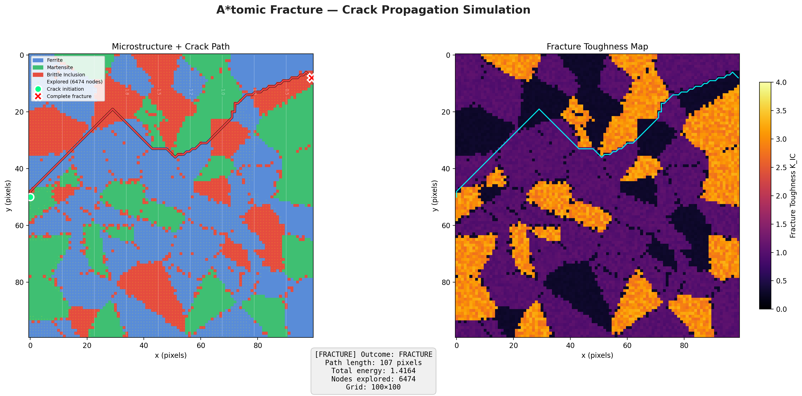
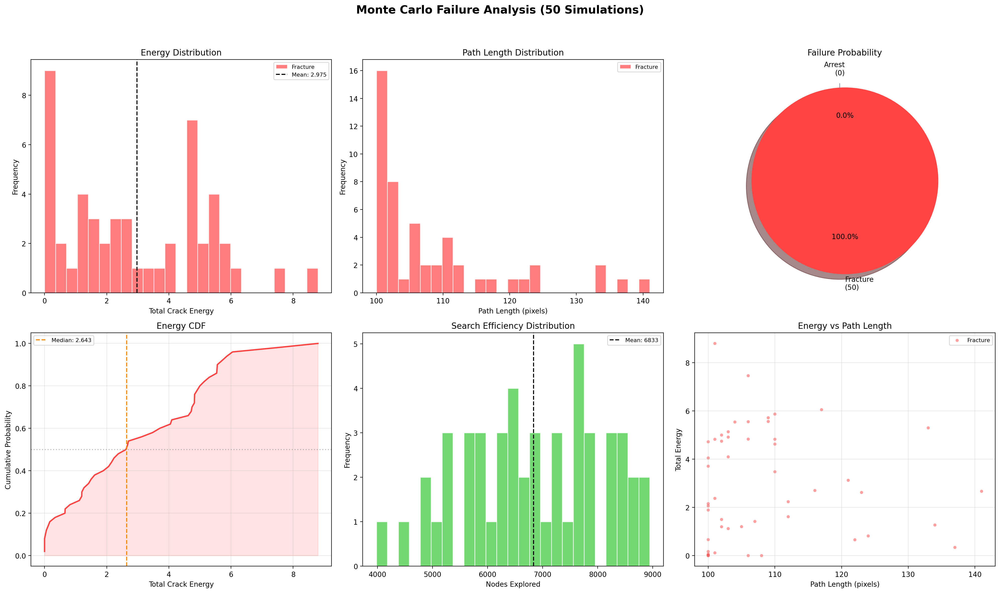

# A*tomic Fracture 🔬💥

> Simulating crack propagation in polycrystalline metals using AI graph search — bridging AI and Materials Science.



## Overview

This project reframes **fracture mechanics** as an **algorithmic state-space search problem**. A synthetic 2D polycrystalline microstructure is modeled as a weighted graph, where:

- **Nodes** = grain regions (ferrite, martensite, brittle inclusions)
- **Edges** = crack propagation paths with physics-based costs
- **A\* Search** finds the **minimum-energy crack path** from a defect to material failure

The simulator uses a **provably admissible heuristic** and **crack arrest pruning** to produce physically meaningful results — cracks route through brittle phases and avoid tough grains, just like in real metals.

## Features

| Feature | Description |
|---------|-------------|
| **Voronoi Microstructure** | Realistic polygonal grain tessellation with 3 metallurgical phases |
| **Real Image Input** | Load SEM/EBSD images and auto-segment into phases (K-means / Otsu / Watershed) |
| **Physics-Correct A\*** | Admissible heuristic, consistent units, `cost = max(0, K_IC - K_applied)` |
| **Algorithm Comparison** | A\* vs Dijkstra vs Greedy Best-First vs BFS — side-by-side benchmarks |
| **Monte Carlo Analysis** | Run N simulations for failure probability distributions and energy CDFs |
| **Crack Arrest** | Pruning nodes where stress intensity falls below threshold |
| **Animated Exploration** | Optional GIF export showing A\* exploring the microstructure step-by-step |

---

## Algorithm Comparison


| Algorithm | Path Cost | Nodes Explored | Optimal? |
|-----------|----------|----------------|----------|
| **A\* Search** | **1.4164** | 6,474 | ✅ Yes |
| **Dijkstra** | **1.4164** | 6,474 | ✅ Yes |
| Greedy Best-First | 8.0507 | 417 | ❌ 5.7× worse |
| BFS (Unweighted) | 45.3972 | 10,000 | ❌ 32× worse |

A\* and Dijkstra find the **same optimal path** — proving our heuristic is admissible. A\* is the right choice because it's optimal AND can leverage domain knowledge through its heuristic.

---

## Monte Carlo Failure Analysis



Run 50–1000 simulations with randomly varying microstructures to answer: **"What is the probability of this material failing?"**

- Energy distributions and CDFs
- Failure vs arrest probability
- Path length statistics
- CSV export for external analysis

---

## Metallurgical Phases

| Phase | K_IC (Toughness) | Behavior |
|-------|------------------|----------|
| 🔵 Ferrite (soft) | ~1.0 | Moderate resistance — ductile matrix |
| 🟢 Martensite (hard) | ~3.0 | High resistance — crack deflects around |
| 🔴 Brittle Inclusion | ~0.3 | Low resistance — crack snaps through |

## Quick Start

```bash
pip install -r requirements.txt

python main.py

python main.py --compare

python main.py --monte-carlo --mc-runs 100

python main.py --image microstructure.png

python main.py --compare --image microstructure.png

python main.py --size 150 --n-grains 120 --seed 7

python main.py --no-show --animate
```

## How It Works

### 1. Environment Generation (`environment.py`)
- Voronoi tessellation creates polygonal grains
- Each grain assigned a metallurgical phase
- Brittle inclusions scattered at grain boundaries
- Applied stress gradient: high at left, low at right

### 2. Real Image Input (`image_loader.py`)
- Load SEM/EBSD images (PNG, TIFF, JPEG)
- Auto-segment into phases via K-means, Otsu, or watershed
- Map segmented regions to fracture properties

### 3. A\* Search (`astar_search.py`)
- **Edge cost**: `max(0, K_IC - K_applied)` — physics-correct resistance
- **Heuristic**: `euclidean_distance × min_cost_per_unit` — provably admissible
- **Crack arrest**: Prune nodes where `K_applied < K_threshold`

### 4. Algorithm Comparison (`algorithm_comparison.py`)
- A\*, Dijkstra, Greedy Best-First, BFS
- Side-by-side path visualization + bar chart benchmarks

### 5. Monte Carlo Analysis (`monte_carlo.py`)
- N runs with random microstructures
- Failure probability, energy distributions, CDFs
- CSV export for external analysis

## Project Structure

```
AIFA_Project/
├── environment.py              # Voronoi microstructure generation
├── image_loader.py             # Real SEM/EBSD image input
├── astar_search.py
├── algorithm_comparison.py
├── monte_carlo.py              # Statistical failure analysis
├── visualizer.py
├── main.py
├── requirements.txt
└── README.md
```

## Tech Stack

- **Python 3.11+**
- **NumPy / SciPy** — Grid operations, Voronoi tessellation
- **Matplotlib** — Visualization and animation
- **scikit-image / scikit-learn** — Image segmentation (K-means, Otsu, watershed)
- **Pillow** — Image I/O

## Key Corrections from Naive Approaches

| Issue | Naive Approach | Fix |
|-------|---------------|---------|
| Heuristic | `distance / SIF` (non-admissible) | `distance × min_toughness` (admissible) |
| Units | `g(n)` in energy, `h(n)` in m/MPa√m | Both in energy-equivalent units |
| Physics | Inverse SIF penalizes low-stress areas | High SIF reduces cost correctly |
| Goal | Failure and arrest conflated | Separate: boundary = failure, no-path = arrest |
| Threshold | Missing | Prune nodes where K < K_th |

## License

MIT